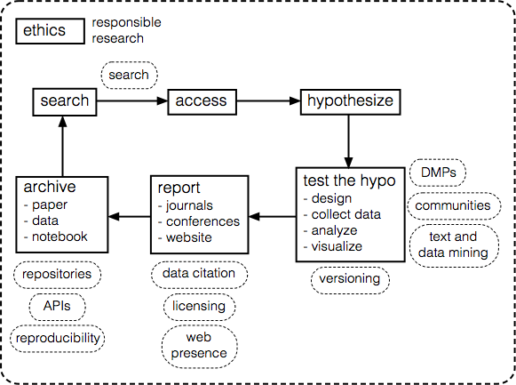

## Course Outline

<figure style="width: 100%; position: relative;">
    
    <figcaption>research lifecycle</figcaption>
</figure>

step                | activity                       
--------------------|--------------------------
search              |
access              |                          
hypothesize         |                          
test the hyposthesis|                          
report              |                          
archive             |                          

### [Searching](searching/index.md)

A better way to search for open content through “visual interface that dramatically increases the visibility of research findings for science and society alike” – [Open Knowledge Maps](https://openknowledgemaps.org/)

### [Versioning](versioning/index.md)

> A component of software configuration management, version control, also known as revision control or source control, is the management of changes to documents, computer programs, large web sites, and other collections of information. Changes are usually identified by a number or letter code, termed the "revision number", "revision level", or simply "revision". For example, an initial set of files is "revision 1". When the first change is made, the resulting set is "revision 2", and so on. Each revision is associated with a timestamp and the person making the change. Revisions can be compared, restored, and with some types of files, merged.

<cite>[Version control](https://en.wikipedia.org/wiki/Version_control). In Wikipedia. Retrieved June 2017</cite>

### [Communities](communities/index.md)

Developer and user communities such as [StackOverflow](https://stackoverflow.com), [PerlMonks](http://perlmonks.org), [CodePen](https://codepen.io) and channels on the [IRC](https://en.wikipedia.org/wiki/Internet_Relay_Chat), are valuable resources for programmers. GitHub itself has issues tracking for the source code hosted on it, as do other source code and software hosting sites. These issues tracking systems are a valuable resource for asking software-specific questions.

### [Repositories](repositories/index.md)

Literature, [software](https://en.wikipedia.org/wiki/Software_repository) and [data](https://en.wikipedia.org/wiki/Research_data_archiving#Data_archives) repositories are essential to archival and discovery of scientific content. Choosing the right repository depends on not just its relevance to one’s content and discipline, but also archival and distribution policies, licenses, and longevity.

### [Publishing](publishing/index.md)

> Academic publishing is the subfield of publishing which distributes academic research and scholarship. Most academic work is published in academic journal article, book or thesis form. The part of academic written output that is not formally published but merely printed up or posted on the Internet is often called "grey literature". Most scientific and scholarly journals, and many academic and scholarly books, though not all, are based on some form of peer review or editorial refereeing to qualify texts for publication. Peer review quality and selectivity standards vary greatly from journal to journal, publisher to publisher, and field to field.

<cite>[Academic publishing](https://en.wikipedia.org/wiki/Academic_publishing). In Wikipedia. Retrieved June 2017</cite>

### [Text and Data Mining](text-and-data-mining/index.md)

<blockquote>
(semi)automated discovery of trends and patterns across very large datasets
…
Use of large online text collections to discover new facts and trends
…
(Automating) the tedious parts of the text manipulation process and (integrating) underlying computationally-driven text analysis with human-guided decision making within exploratory data analysis over text
</blockquote>

<cite>Marti A. Hearst. 1999. [Untangling text data mining](http://dl.acm.org/citation.cfm?doid=1034678.1034679). In Proceedings of the 37th annual meeting of the Association for Computational Linguistics(ACL '99), Stroudsburg, PA, USA, 3-10. doi: 10.3115/1034678.1034679</cite>

### [Licensing](licensing/index.md)

Licensing is the act of applying a license.

> A license, (that is,) is an official permission or permit to do, use, or own something (as well as the document of that permission or permit) … A licensor may grant a license under intellectual property laws to authorize a use (such as copying software or using a (patented) invention) to a licensee, sparing the licensee from a claim of infringement brought by the licensor.

<cite>[License](https://en.wikipedia.org/wiki/License). In Wikipedia. Retrieved Jun 2017</cite>

> The Creative Commons copyright licenses and tools forge a balance inside the traditional “all rights reserved” setting that copyright law creates … (giving) everyone from individual creators to large companies and institutions a simple, standardized way to grant copyright permissions to their creative work.”

<cite>[About the Licenses](https://creativecommons.org/licenses/). CreativeCommons.org. Retrieved June 2017</cite>

### [Responsible Research](responsible-research/index.md)

> researchers need to be open with others for re- search to progress. All researchers deserve to work inde- pendently as they balance the competing considerations of whether their hypotheses are supported or not. But they ul- timately need to convey to others their conclusions and the evidence and reasoning on which their conclusions are based so that those conclusions can be examined and extended. For the empirical and experimental sciences, this requires careful storage of data and making the data and other infor- mation underlying reported results publicly available.

<cite>InterAcademy Partnership. [Doing Global Science: A Guide to Responsible Conduct in the Global Research Enterprise](http://interacademycouncil.com/File.aspx?id=29431). Princeton University Press. Retrieved June 2017</cite>

### [Data Management Plans](data-management-plans/index.md)

> A data management plan is a formal document that outlines what you will do with your data during and after a research project. Most researchers collect data with some form of plan in mind, but it's often inadequately documented and incompletely thought out. Many data management issues can be handled easily or avoided entirely by planning ahead. With the right process and framework it doesn't take too long and can pay off enormously in the long run.

<cite>FAQ CDLUC3. [What is a data management plan](https://github.com/CDLUC3/dmptool/wiki/FAQ#q-what-is-a-data-management-plan-dmp). CDL. Retrieved June 2017]</cite>

### [Web Presence](web-presence/index.md)

<blockquote>
Is web-presence important for researchers? How important is web-presence to researchers? How does its importance vary by fields?
 
Having a visible online presence is just another form of networking. Similarly, if you want to attract good students, they have to know who you are, they have to know what you do, and they have to think what you do is interesting. Similarly, if your work is not freely and easily accessible on the web, it is much less likely to be cited than freely accessible work of comparable quality.
</blockquote>

<cite>@JeffE. [“Answer to Question 'Is web-presence important for researchers?'”](https://academia.stackexchange.com/questions/616/is-web-presence-important-for-researchers/620). March 2012. Retrieved June 2017</cite>

### [APIs](apis/index.md)

> In computer programming, an application programming interface (API) is a set of subroutine definitions, protocols, and tools for building application software. In general terms, it is a set of clearly defined methods of communication between various software components. A good API makes it easier to develop a computer program by providing all the building blocks, which are then put together by the programmer. An API may be for a web-based system, operating system, database system, computer hardware or software library. An API specification can take many forms, but often includes specifications for routines, data structures, object classes, variables or remote calls. POSIX, Microsoft Windows API, the C++ Standard Template Library and Java APIs are examples of different forms of APIs. Documentation for the API is usually provided to facilitate usage.

<cite>[Application programming interface](https://en.wikipedia.org/wiki/Application_programming_interface). In Wikipedia. Retrieved June 2017</cite>

### [Reproducibility](reproducibility/index.md)

> Reproducibility—the ability to recompute results—and replicability—the chances other experimenters will achieve a consistent result—are two foundational characteristics of successful scientific research. Consistent findings from independent investigators are the primary means by which scientific evidence accumulates for or against a hypothesis. Yet, of late, there has been a crisis of confidence among researchers worried about the rate at which studies are either reproducible or replicable. To maintain the integrity of science research and the public’s trust in science, the scientific community must ensure reproducibility and replicability by engaging in a more preventative approach that greatly expands data analysis education and routinely uses software tools.

<cite>Jeffrey T. Leek and Roger D. Peng 
[Opinion: Reproducible research can still be wrong: Adopting a prevention approach](http://www.pnas.org/content/112/6/1645.full). PNAS 2015 112: 1645-1646. Retrieved June 2017</cite>